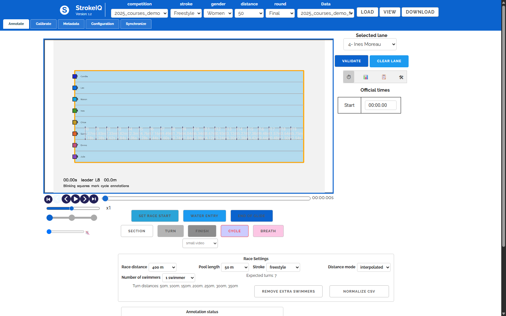
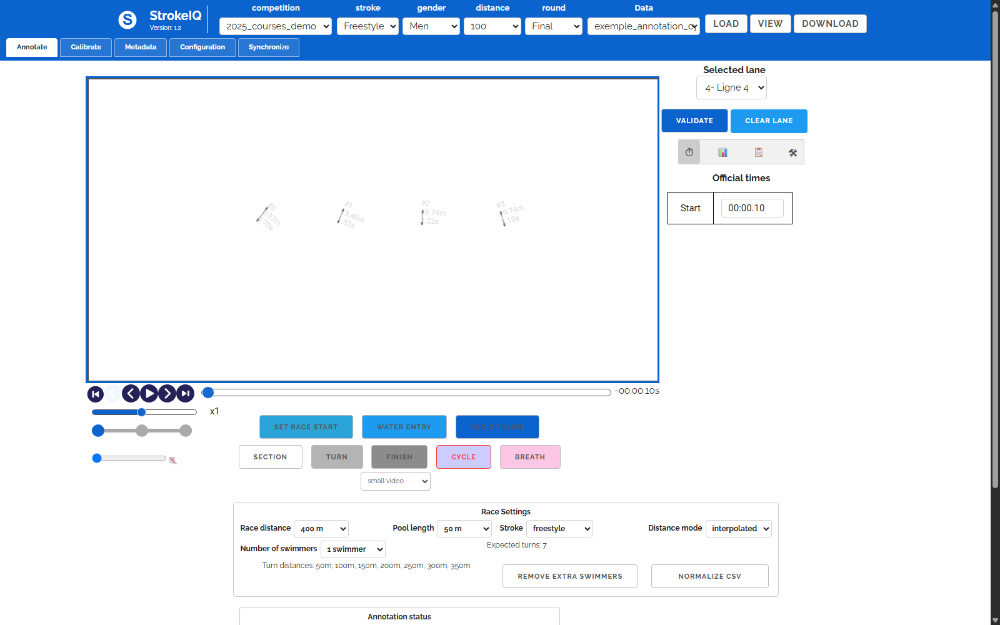

# StrokeIQ

StrokeIQ is a swimming race video annotation and analysis workspace. It helps you load a race video, mark swimming events on the timeline, save the annotations as CSV, and review performance metrics such as cumulative distance, cycle distance, tempo, frequency, amplitude, and speed.

The project is designed for practical race review: one swimmer or multiple swimmers, local video folders, CSV export, and repeatable analysis from the same annotation data.





## What StrokeIQ Does

- Load swimming race videos from the `videos/` folder.
- Annotate race events: race start, water entry, end of glide, cycle, breath, turn, section, and finish.
- Track one swimmer or several swimmers depending on `numberOfSwimmers`.
- Store race metadata in JSON files beside each video.
- Store annotation events in CSV files beside each video.
- Calculate cumulative race distance from annotation timing.
- Support interpolated distance mode for videos where the race does not start exactly at video time `0`.
- Export CSV data for analysis.
- Show tables and graphs for cycle-by-cycle performance review.

## Why This Project Exists

StrokeIQ is built for swimming video work where manual annotation needs to stay connected to measurable race data. The main goal is simple:

1. Put the video and metadata in the correct race folder.
2. Load the race in the web UI.
3. Mark the important swimming events.
4. Save or export the CSV.
5. Review the analysis without mixing swimmers, lanes, or old demo data.

## Main Screens

**Annotate**

This is the main working screen. Use it to play the video, select the swimmer/lane, add race events, validate annotations, and save CSV output.

**Calibrate**

Used when working with calibration points and pool geometry. If calibrated distance is not valid, the project can fall back to interpolated distance.

**Metadata**

Used to edit race information such as swimmers, lanes, race distance, pool length, and related metadata.

**Configuration**

Used to choose how the app loads data:

- `static`: read-only/static file mode
- `local`: local Python server mode for your machine
- `api`: external API mode

**Synchronize**

Used for synchronization workflows when multiple sources or cameras are involved.

## Project Structure

```text
.
+-- index.html                 # Main StrokeIQ web interface
+-- local.py                   # Local Python server for videos and metadata
+-- assets/
|   +-- css/                   # UI styling and blue StrokeIQ theme
|   +-- js/                    # Annotation, loading, analysis, CSV, and UI logic
|   +-- images/                # Logo and app assets
+-- videos/                    # Race folders, videos, JSON metadata, and CSV annotations
+-- scripts/                   # Helper scripts for generated datasets
+-- workflow/test/             # Unit, integration, and browser tests
+-- docs/images/               # README screenshots captured from the real app
+-- requirements.txt           # Python dependencies
+-- package.json               # JavaScript tooling and test scripts
```

## Run The Project

### Option 1: Local mode for real work

Use this when you want the UI to see your local `videos/` folder and save/update files.

Open PowerShell in the project folder:

```powershell
cd "path\to\StrokeIQ"
.\.venv\Scripts\python.exe local.py --port 8000
```

In another PowerShell window:

```powershell
cd "path\to\StrokeIQ"
python -m http.server 8001 --bind 127.0.0.1
```

Open:

```text
http://127.0.0.1:8001/?source=local
```

### Option 2: Static mode

Use this for read-only testing or screenshots:

```powershell
cd "path\to\StrokeIQ"
python -m http.server 8001 --bind 127.0.0.1
```

Open:

```text
http://127.0.0.1:8001/?source=static
```

## Video Folder Format

Each race should live inside `videos/` using this shape:

```text
videos/
└── 2026_my_competition/
    └── 2026_my_competition_freestyle_hommes_50_finale/
        ├── 2026_my_competition_freestyle_hommes_50_finale.mp4
        ├── 2026_my_competition_freestyle_hommes_50_finale.json
        └── 2026_my_competition_freestyle_hommes_50_finale.csv
```

The JSON file stores race metadata. The CSV file stores annotations.

For a one-swimmer local race, the metadata should include:

```json
{
  "numberOfSwimmers": 1,
  "raceDistanceM": 50,
  "poolLengthM": 25,
  "distanceMode": "interpolated",
  "swimmerName": "Swimmer 1"
}
```

## Annotation Events

Common events:

- `reaction`: the race start reference point, usually distance `0m`
- `enter`: water entry
- `end`: end of glide or breakout
- `cycle`: stroke cycle marker
- `breath`: breathing marker
- `turn`: wall turn marker
- `section`: split or custom section marker
- `finish`: race finish marker

In interpolated mode, the app uses anchor events to calculate distance:

- reaction = `0m`
- first turn in a 25m pool = `25m`
- second turn = `50m`
- finish = race distance

Events between anchors are interpolated by race time. This is important when the video starts before or after the actual race start.

## CSV Output

The annotation CSV contains rows like:

```text
frameId,swimmerId,swimmerName,lane,cumul,eventId,eventX,eventY,event,TempsVideo,Temps (s),distance (m),tempo (s),frequence,amplitude,vitesse (m/s)
```

Important columns:

- `swimmerId`: swimmer index, starting at `0`
- `swimmerName`: saved swimmer name
- `lane`: lane label such as `ligne1`
- `event`: annotation type
- `Temps (s)`: race time
- `distance (m)`: cumulative distance in meters
- `tempo (s)`: time between consecutive cycle events
- `amplitude`: distance between consecutive cycle events
- `vitesse (m/s)`: amplitude divided by tempo

## One-Swimmer Mode

For custom races with one swimmer:

- set `numberOfSwimmers` to `1`
- use only `swimmerId = 0`
- use only `lane = ligne1`
- the UI should show only one swimmer
- CSV export should keep only swimmer `0`
- analysis and graphs should use only swimmer `0`

If an old CSV contains swimmers `1-7`, use the cleanup button in Race Settings to remove extra swimmers before exporting again.

## Development Notes

Run JavaScript tests when Node dependencies are installed:

```powershell
npm test
```

Run the browser tests:

```powershell
npm run test:e2e
```

If Node is not installed on the machine, the Python local/static run commands above are enough to open and use the UI.

## Repository

GitHub:

```text
https://github.com/Mahmoudmoh-cse/StrokeIQ
```

## Credits

StrokeIQ is customized for this swimming annotation workflow. The visible app branding, README, screenshots, and working instructions are specific to StrokeIQ.
